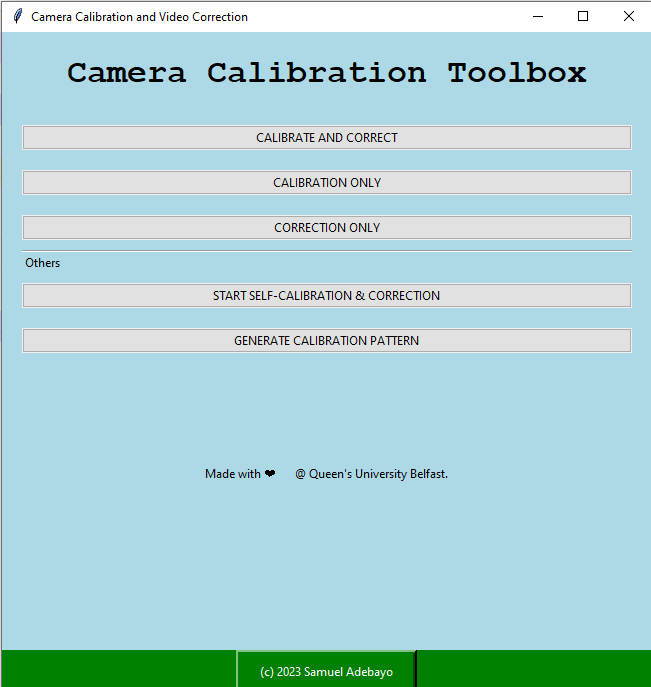

# Camera Calibration Toolbox


Read about Calibration [here](https://samueladebayo.com/camera-calibration-part-1)
## Table of Contents

- [Introduction](#introduction)
- [Features](#features)
  - [Experimental Features](#experimental-features)
- [Prerequisites](#prerequisites)
- [Installation](#installation)
- [Usage](#usage)
  - [Loading Configuration](#loading-configuration)
  - [Starting Calibration or Correction](#starting-calibration-or-correction)
- [Screenshots](#screenshots)
- [Video Guide](#video-guide)
- [Development Status](#development-status)
- [Contributing](#contributing)
- [License](#license)
- [Acknowledgements](#acknowledgements)

## Introduction

The Calibration and Correction GUI is a Python-based application aimed to facilitate video calibration and correction tasks. Leveraging OpenCV for video processing and Tkinter for the graphical interface, this application is designed with academic and industrial research in mind.

## Features

- Automated video calibration using Charuco boards
- Real-time display of corrected and uncorrected video streams
- Ability to save calibration parameters for future use
- Easy-to-use graphical interface with intuitive controls
- Option to load custom calibration files
- Extensive logging to monitor calibration and correction processes
- Frame interval and frame save settings for enhanced control

### Experimental Features

- Play/Pause controls for video review (In Development)
- Slider for video navigation (In Development)

## Prerequisites

- Python 3.x
- Tkinter
- OpenCV
- NumPy
- configparser

## Installation

1. Clone the repository:
   ```bash
   git clone https://github.com/exponentialR/QUBVidCalib.git

2. Install the required packages:
    ```bash
   pip install -r requirements.txt

3. Starting the app
   ```bash 
   cd src 
   python3 main.py

## Usage
### Loading Configuration
Loading Configuration
On application start, the GUI loads existing configurations from settings.ini if available. Users have the option to manually set the following parameters:

- Project Repository 
- Project Name 
- Video Files 
- Calibration Board Dimensions 
- Frame Interval  
- Number of Frames to Save 
- Dictionary Type 

### Starting Calibration or Correction
The main window offers three options:

1. **Calibrate Only**: Perform only the calibration step.
2. **Correct Only**: Perform only the correction step.
3. **Calibrate and Correct**: Perform both calibration and correction.
Once started, the application provides real-time logging and status updates. The corrected video and calibration parameters can be saved for future use.

## Development Status
- Play/Pause controls: Still under development.
- Slider: Still under development.

## Contributing
Feel free to fork this repository and submit a pull request if you have some features or fixes to contribute. For more information, please read the CONTRIBUTING.md guide.

## License
This project is licensed under the MIT License - see the [LICENSE.md](./LICENSE.md) file for details.


## TODO 
> Update for Chess board use

> Work on the Video Player
